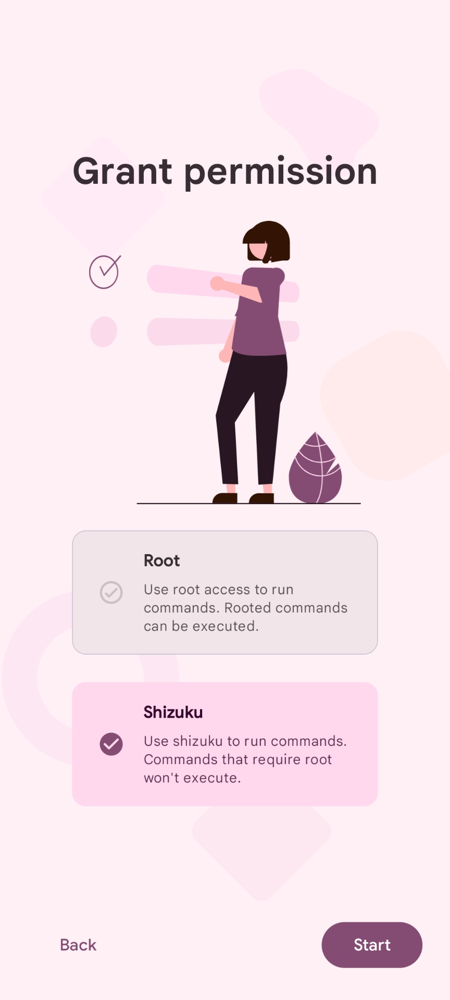
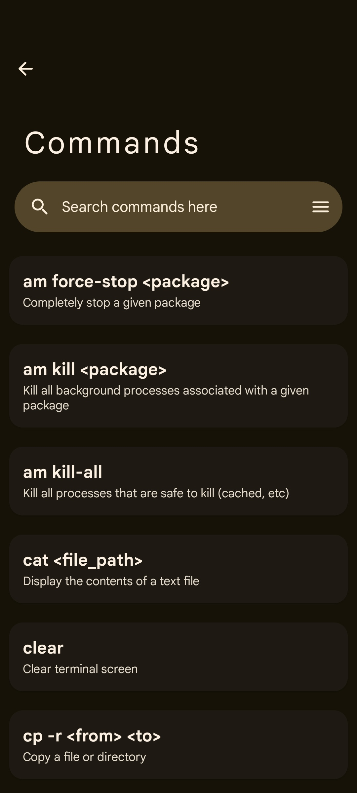
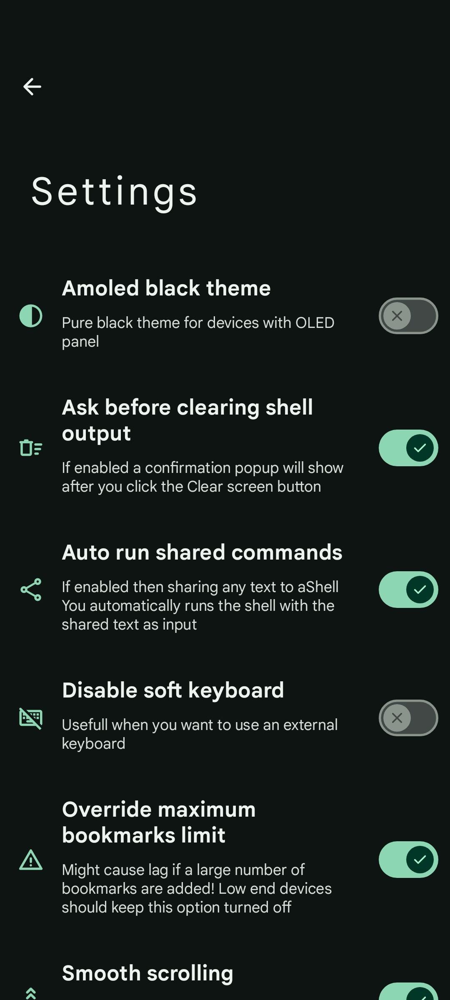
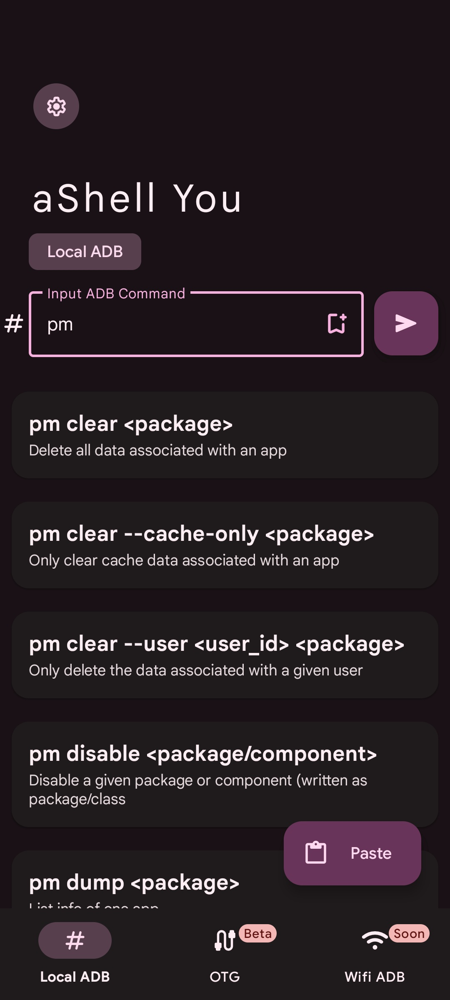
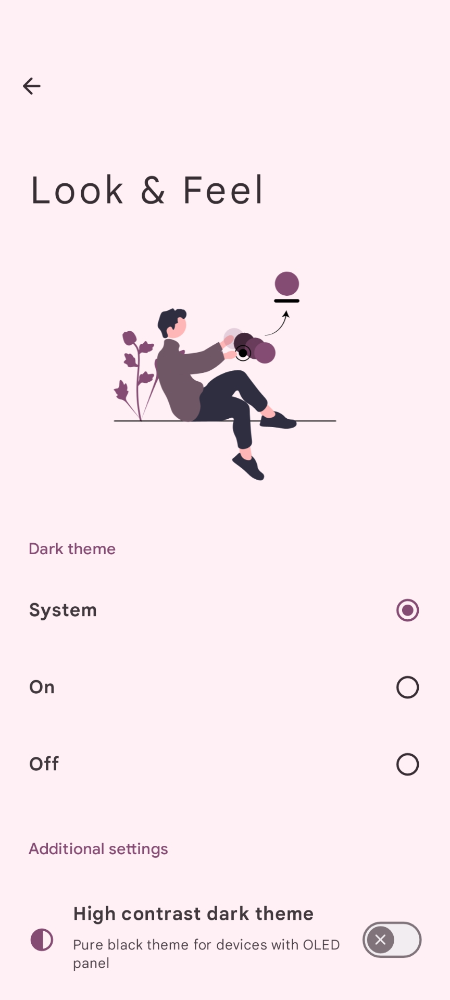
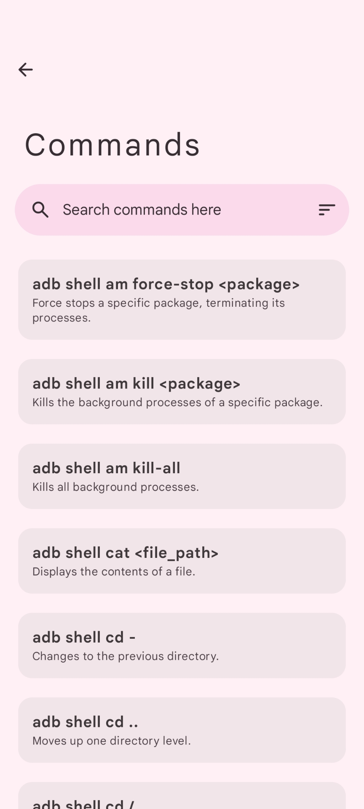
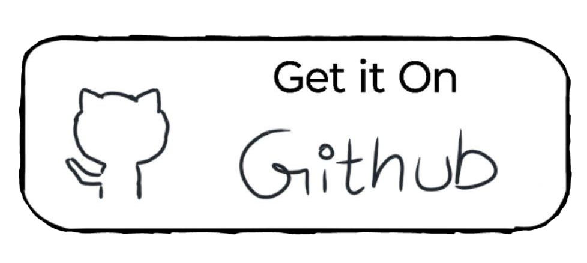

<p align="center">
  
</p>

> **aShell You** is a fully-featured Android shell utility app with **Material Design 3 UI**, letting you run **ADB**, **root** and **shell** commands on your  device or others via OTG/wireless, packed in a beautiful and smart interface

</br>

<p align="center"> 
<a href="https://github.com/DP-Hridayan/aShellYou/stargazers">
    
  </a>
  <a href="https://github.com/DP-Hridayan/aShellYou/forks">
    
  </a>
  <a href="https://github.com/DP-Hridayan/aShellYou/issues">
    
  </a>
  <a href="https://github.com/DP-Hridayan/aShellYou/releases">
    
  </a>
  <a href="https://github.com/DP-Hridayan/aShellYou/releases">
    
  </a>
  <a href="https://github.com/DP-Hridayan/aShellYou/graphs/contributors">
    
  </a>
  <a href="https://github.com/DP-Hridayan/aShellYou/blob/main/LICENSE">
    
  </a>
</p>

<p align="center"> 
    
  
  
  
  
  <a href="https://crowdin.com/project/ashellyou">
    
</a>
</p>

</br>

<h2 align="center">Screenshots</h2>
  <div align="center">
  
  
  
  <br/>
  
  
  
  <br/>
</div>

</br>

## Features

🎨 **Modern Material Design 3 UI**  
> Experience a clean, smooth, and responsive user interface built with Material You, adapting to your device's wallpaper and theme settings.
</br>

📲 **Execute Commands with Ease**  
> Run ADB shell commands directly on your device using Shizuku, root access, or Wireless Debugging — all without needing a PC.
</br>

🔌 **Control Other Devices**  
> Send ADB commands to other Android devices using OTG cable or Wireless Debugging — perfect for developers and tinkerers.
</br>

📚 **Common ADB Command Examples**  
> Built-in examples help you understand and run useful commands instantly without memorizing syntax.
</br>

🛠️ **Support for Continuous Commands** 
> Seamlessly run long or continuous shell commands like `logcat`, `top`, or `watch` and view live updates without interruptions.
</br>

🔍 **Search in Command Output**  
> Quickly find what you're looking for in the output of your last command using the integrated search functionality.
</br>

📝 **Save Output to File**  
> Save the output of any command to a `.txt` file for future reference or sharing — handy for logs and debugging.
</br>

📤 **Share Output Instantly**  
> One-tap sharing lets you send your output to other apps like Notes, Gmail, or Telegram.
</br>

📑 **Bookmark Commands**  
> Save frequently used commands to bookmarks so you can run them again with a single tap.
</br>

🌑 **AMOLED-Friendly Dark Theme**  
> Includes a sleek dark mode designed to save battery and look great on AMOLED screens.
</br>

🎉 **Packed with Extras**  
> Tons of small but useful features to enhance your productivity and make ADB power-user workflows smoother.

</br>

## Requirements

> * A working **[Shizuku](https://shizuku.rikka.app/)** environment or **root access**
> * Shizuku/Root is **not required** when executing ADB commands on **other devices** using **OTG** or **Wireless Debugging**

<br/>

>[!CAUTION]
>
> Using **aShell You** requires basic knowledge of `ADB/Linux commands`.
>**aShell You** is **not responsible** for any harm caused to your device by improper use of ADB commands

<br/>

>[!TIP]
>
> Please visit our **[Wiki](https://github.com/DP-Hridayan/aShellYou/wiki)** for instructions/setup-guides

</br>

## Resources & Links

<p align="start">
  <a href="https://github.com/DP-Hridayan/aShellYou/releases/latest/">
    
  </a>
  &nbsp;&nbsp;
  <a href="https://apt.izzysoft.de/fdroid/index/apk/in.hridayan.ashell">
    
  </a>
  <br/><br/>
  <a href="https://t.me/aShellYou">
    
  </a>
  <br/><br/>
  <a href="https://www.buymeacoffee.com/Hridayan">
    
  </a></p>

  </br>

## Translations

<p align="start">
  <picture>
    <source media="(prefers-color-scheme: dark)" srcset="docs/translations-dark.svg?ts=1746620621">
    <source media="(prefers-color-scheme: light)" srcset="docs/translations-light.svg?ts=1746620621">
    
  </picture>
</p>

>[!NOTE]
>
> Help us make this project accessible to more people by contributing translations on **[Crowdin](https://crowdin.com/project/ashellyou)**
>
> Thanks to our Crowdin [translators](docs/translators.md)

</br>

## Task list

<table align="start" style="border-collapse: collapse; margin-top: 20px;">
  <tr>
    <th style="padding: 8px; border: 1px solid #ddd; text-align: left;">Task</th>
    <th style="padding: 8px; border: 1px solid #ddd; text-align: left;">Status</th>
  </tr>
  <tr>
    <td style="padding: 8px; border: 1px solid #ddd;">Wifi ADB Feature</td>
    <td style="padding: 8px; border: 1px solid #ddd; color: green;">✅ Done</td>
  </tr>
  <tr>
    <td style="padding: 8px; border: 1px solid #ddd;">Implement root shell</td>
    <td style="padding: 8px; border: 1px solid #ddd; color: green;">✅ Done</td>
  </tr>
  <tr>
    <td style="padding: 8px; border: 1px solid #ddd;">Migrate to kotlin</td>
    <td style="padding: 8px; border: 1px solid #ddd; color: green;">⏺️ In progress</td>
  </tr>
  <tr>
    <td style="padding: 8px; border: 1px solid #ddd;">Proper localization</td>
    <td style="padding: 8px; border: 1px solid #ddd; color: gray;">⬜ To Do</td>
  </tr>
  <tr>
    <td style="padding: 8px; border: 1px solid #ddd;">Fix scripts execution</td>
    <td style="padding: 8px; border: 1px solid #ddd; color: gray;">⬜ To Do</td>
  </tr>
  <tr>
    <td style="padding: 8px; border: 1px solid #ddd;">Add Fastboot</td>
    <td style="padding: 8px; border: 1px solid #ddd; color: gray;">⬜ To Do</td>
  </tr>
</table>

<br/>

## Star history

<a href="https://star-history.com/#DP-Hridayan/aShellYou&Date">
 <picture>
   <source media="(prefers-color-scheme: dark)" srcset="https://api.star-history.com/svg?repos=DP-Hridayan/aShellYou&type=Timeline&theme=dark" />
   <source media="(prefers-color-scheme: light)" srcset="https://api.star-history.com/svg?repos=DP-Hridayan/aShellYou&type=Date" />
   
 </picture>
</a>

<br></br>

## License

```
Designed and developed by DP Hridayan @2024
This project is licensed under the GNU General Public License v3.0
```
>[!NOTE]
>
>Full license copy [here](LICENSE.md)

</br>

## Contributors
<a href="https://github.com/dp-hridayan/ashellyou/graphs/contributors">
  
</a>
</br>
