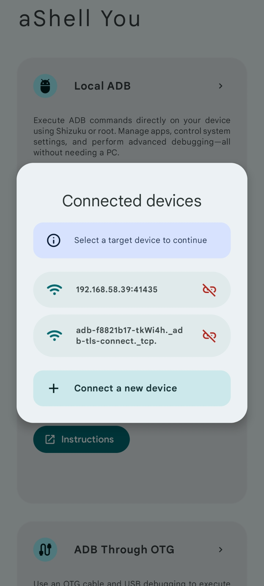

<p align="center">
  
</p>

> aShell You is a fully-featured Android shell utility with **Material Design 3 UI**, letting you run ADB, root, and shell commands on this device or others via OTG/wireless, packed in a beautiful and smart interface.

</br>

<p align="center"> 
<a href="https://github.com/DP-Hridayan/aShellYou/stargazers">
    
  </a>
  <a href="https://github.com/DP-Hridayan/aShellYou/forks">
    
  </a>
  <a href="https://github.com/DP-Hridayan/aShellYou/issues">
    
  </a>
  <a href="https://github.com/DP-Hridayan/aShellYou/releases">
    
  </a>
  <a href="https://github.com/DP-Hridayan/aShellYou/releases">
    
  </a>
  <a href="https://github.com/DP-Hridayan/aShellYou/graphs/contributors">
    
  </a>
  <a href="https://github.com/DP-Hridayan/aShellYou/blob/main/LICENSE">
    
  </a>
</p>

<p align="center"> 
    
   
  
  
  
</p>

</br>

<h2 align="center">Screenshots</h2>
  <div align="center">
  
  
  
  <br/>
  
  
  
  <br/>
</div>

</br>

<h2 align="center">Features</h2>

🎨 **Modern Material Design 3 UI**  
> Experience a clean, smooth, and responsive user interface built with Material You, adapting to your device's wallpaper and theme settings.
</br>

📲 **Execute Commands with Ease**  
> Run ADB shell commands directly on your device using Shizuku, root access, or Wireless Debugging — all without needing a PC.
</br>

🔌 **Control Other Devices**  
> Send ADB commands to other Android devices using OTG cable or Wireless Debugging — perfect for developers and tinkerers.
</br>

📚 **Common ADB Command Examples**  
> Built-in examples help you understand and run useful commands instantly without memorizing syntax.
</br>

🛠️ **Support for Continuous Commands** 
> Seamlessly run long or continuous shell commands like `logcat`, `top`, or `watch` and view live updates without interruptions.
</br>

🔍 **Search in Command Output**  
> Quickly find what you're looking for in the output of your last command using the integrated search functionality.
</br>

📝 **Save Output to File**  
> Save the output of any command to a `.txt` file for future reference or sharing — handy for logs and debugging.
</br>

📤 **Share Output Instantly**  
> One-tap sharing lets you send your output to other apps like Notes, Gmail, or Telegram.
</br>

📑 **Bookmark Commands**  
> Save frequently used commands to bookmarks so you can run them again with a single tap.
</br>

🌑 **AMOLED-Friendly Dark Theme**  
> Includes a sleek dark mode designed to save battery and look great on AMOLED screens.
</br>

🎉 **Packed with Extras**  
> Tons of small but useful features to enhance your productivity and make ADB power-user workflows smoother.

</br>

<h2 align="center">Requirements</h2>

> * A working **[Shizuku](https://shizuku.rikka.app/)** environment or **root access**
> * Shizuku/Root is **not required** when executing ADB commands on **other devices** using **OTG** or **Wireless Debugging**
> * Basic knowledge of **ADB/Linux commands** is recommended

<br/>

<h2 align="center">Instructions</h2>

⚙️ **How to Setup Shizuku**  
> [Follow this guide](https://github.com/DP-Hridayan/aShellYou/blob/master/instructions/Shizuku.md) to configure Shizuku on your device.

<br/>

🔌 **How to Use OTG**  
> Learn to connect and control another Android device via OTG [using this guide](https://github.com/DP-Hridayan/aShellYou/blob/master/instructions/OTG.md).

<br/>

🛜 **How to Use Wireless ADB**  
> Enable and use ADB wirelessly to run commands on other devices [with this guide](https://github.com/DP-Hridayan/aShellYou/blob/master/instructions/wirelessDebugging.md).

<br/>

<h2 align="center">Resources & Links</h2>

<p align="center">  <!-- Download buttons -->  <a href="https://github.com/DP-Hridayan/aShellYou/releases/latest/">
    
  </a>
  &nbsp;&nbsp;
  <a href="https://apt.izzysoft.de/fdroid/index/apk/in.hridayan.ashell">
    
  </a>
  <br/><br/>  <!-- Telegram button -->  <a href="https://t.me/aShellYou">
    
  </a>
  <br/><br/>  <!-- Buy Me a Coffee -->  <a href="https://www.buymeacoffee.com/Hridayan">
    
  </a></p>

  </br>

<h2 align="center">Task list</h2>

<table align="center" style="border-collapse: collapse; margin-top: 20px;">
  <tr>
    <th style="padding: 8px; border: 1px solid #ddd; text-align: left;">Task</th>
    <th style="padding: 8px; border: 1px solid #ddd; text-align: left;">Status</th>
  </tr>
  <tr>
    <td style="padding: 8px; border: 1px solid #ddd;">Wifi ADB Feature</td>
    <td style="padding: 8px; border: 1px solid #ddd; color: green;">✅ Done</td>
  </tr>
  <tr>
    <td style="padding: 8px; border: 1px solid #ddd;">Implement root shell</td>
    <td style="padding: 8px; border: 1px solid #ddd; color: green;">✅ Done</td>
  </tr>
  <tr>
    <td style="padding: 8px; border: 1px solid #ddd;">Redesigning Homepage</td>
    <td style="padding: 8px; border: 1px solid #ddd; color: green;">✅ Done</td>
  </tr>
  <tr>
    <td style="padding: 8px; border: 1px solid #ddd;">Proper localization</td>
    <td style="padding: 8px; border: 1px solid #ddd; color: gray;">⬜ To Do</td>
  </tr>
  <tr>
    <td style="padding: 8px; border: 1px solid #ddd;">Fix scripts execution</td>
    <td style="padding: 8px; border: 1px solid #ddd; color: gray;">⬜ To Do</td>
  </tr>
  <tr>
    <td style="padding: 8px; border: 1px solid #ddd;">Add Fastboot</td>
    <td style="padding: 8px; border: 1px solid #ddd; color: gray;">⬜ To Do</td>
  </tr>
</table>

<br/>

<h2 align="center">Star history</h2>

<a href="https://star-history.com/#DP-Hridayan/aShellYou&Date">
 <picture>
   <source media="(prefers-color-scheme: dark)" srcset="https://api.star-history.com/svg?repos=DP-Hridayan/aShellYou&type=Date&theme=dark" />
   <source media="(prefers-color-scheme: light)" srcset="https://api.star-history.com/svg?repos=DP-Hridayan/aShellYou&type=Date" />
   
 </picture>
</a>

</br>

<h2 align="center">License</h2>

```
Designed and developed by Hridayan @2024
This project is licensed under the GNU General Public License v3.0
```
[Full License copy here](LICENSE.md)

</br>

<h2 align="center">Summary</h2>

| Permitted 🚀                         | Not Permitted 🚫                     |
|--------------------------------------|--------------------------------------|
| ✔️ Use for commercial purposes       | ❌ Sub-licensing                     |
| ✔️ Modify and distribute             | ❌ Proprietary use without source    |
| ✔️ Private use                       | ❌ Distribution without same license |
| ✔️ Access to the source code         | ❌ Restricting other users' freedoms |
| ✔️ Distribution with original terms  |                                      |

</br>

<h2 align="center">Contributors</h2>
<a href="https://github.com/dp-hridayan/ashellyou/graphs/contributors">
  
</a>
</br>
